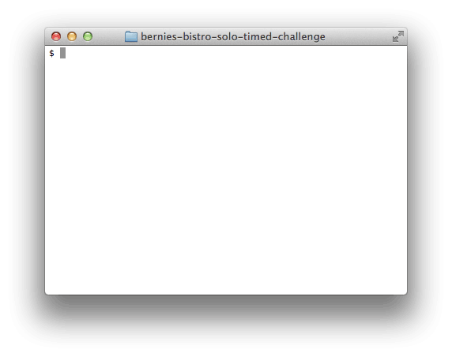

# Bernie's Bistro
Forked from Dev Bootcamp.
Completed March 15, 2017.
Challenge limited to hour and a half to complete.

## Summary
I built "Bernie's" restaurant's recipe system.

### Recipe System Use Cases

*Figure 1*. Example usage, listing all recipes and displaying a specific recipe.

The recipe system should support two uses:  (1) users should be able to list all the recipes in the system and (2) users should be able to display the details for a specific recipe.  Figure 1 displays both of these uses and how Bernie would like to run the application.
